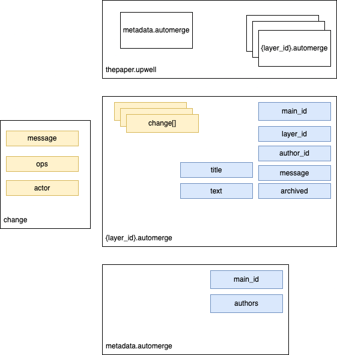

# Data Model

## Upwell 

An `.upwell` is a file format. An upwell is a tar file that contains multiple files. 

| filename | type | description
| --- | --- | --- | 
| {layer_id}.automerge | UpwellLayer | Multiple documents, with the layer id in the filename
| metadata.automerge | Metadata | An automerge document with the upwell metadata in it

### Files
#### metadata.automerge

The `metadata.automerge` file is an Automerge document that contains the metadata about this upwell. It is an Automerge document because we want to be able to update the id or authors in a way that respects the fact that multiple people could edit these properties concurrently over time. It is also separate from any particular layer or version of the document, as it contains information that is important for downstream applications to be able to properly render UI elements. It has the following properties:

| prop | type | description 
| --- | --- | --- 
| main_id | string | The root id of this upwell, which should point to a layer on disk. If that layer doesn't exist, things are bad!!! 
| authors | Map<author_id, Map> | A map of author_id to author metadata (e.g., { name: string, email: string }). 

#### {layer_id}.automerge

A Layer is an encapsulated class around an Automerge document. Each Layer also is assigned a layer id which is unique to the document. Every layer **SHOULD** have a common ancestor with the `main_id` document, defined in `metadata.automerge`. It is hard to enforce this but generally as long as all layers are created using `upwell.create` method, this will be true.

A layer has the following properties:

| prop | type | description
| --- | --- | --- | 
| text | Automerge.TEXT | A growable array CRDT that implements the Peritext algorithm.
| title | Automerge.TEXT | A human-readable title of the document.
| meta | Map | An instance of LayerMetadata

LayerMetadata is a Map that has the following properties:

| prop | type | description
| --- | --- | --- | 
| parent_id | string | The layer_id of the document this layer was derived from.
| layer_id | string | A unqiue identifer for this layer.
| author_id | string | The id of the author who created this layer. 
| message | string | A human-readable message to describe the layer.
| archived | boolean | If this layer has been archived

#### Notes

This architecture prevents us from leaking any Automerge calls to the React frontend, which enables frontend and backend teams to iterate in parallel. It also helps us create a test suite and improve the reliability of the system which is crucial for making sure demos go hopefully slightly better than average.
